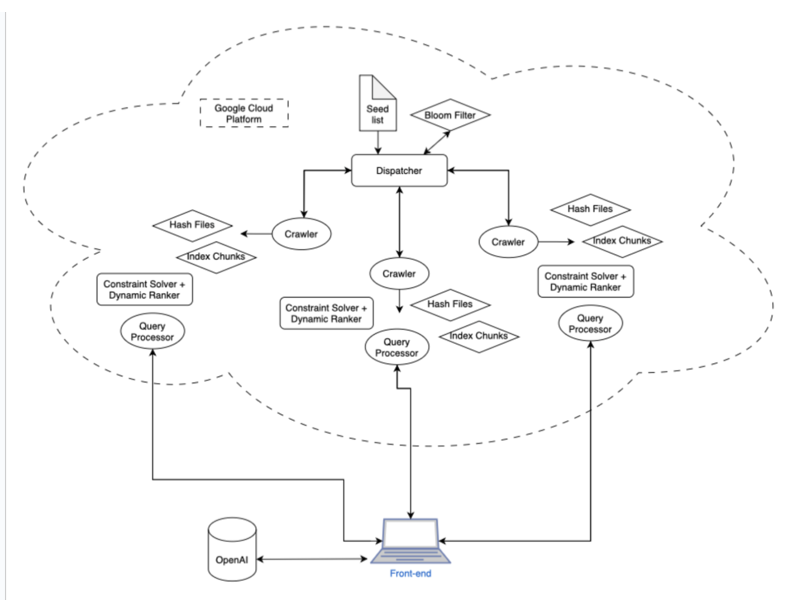

# 404 Found Search Engine
A distributed web search engine developed for EECS 498-005 (System Design of a Search Engine).

## Overview
This project features all the components of a large-scale search engine. It includes a distributed web crawler, an efficient indexing system, and a distributed query processing system designed to handle searches over the indexed data. The system was designed to be deployed and run on cloud platforms like Google Cloud Platform (GCP) and features a user-friendly JavaScript frontend.

## Key Features
*   **JavaScript Frontend:** Provides an beautiful and animated web interface to submit queries and view results.
*   **AI Overview:** Generates concise, AI-powered summaries for search results, similar to modern search engine features.
*   **Image Search:** Supports image to text search.
*   **Distributed Web Crawler:** Deployed on GCP, capable of crawling **6.9 million pages per hour** across 12 Virtual Machines.
*   **Highly-Compressed Inverted Index:** Implements an inverted index to store data for **100 million pages**, utilizing compression techniques to achieve an average data size of 6KB per page.
*   **Distributed Query System:** Optimized query processing designed to achieve an average query latency of **100 milliseconds** for text searches.
*   **Scalable Architecture:** Components (frontend, backend query processor, indexer, crawler) designed for distributed execution.

## Tech Stack
*   **Frontend:** JavaScript, HTML, CSS
*   **Backend & Core Logic:** C++
*   **Deployment & Infrastructure:** Google Cloud Platform (GCP)
  
## Architecture

## Team Members  
- **Alex Radomski** ([alexrad@umich.edu](mailto:alexrad@umich.edu))  
- **Anton Petushkov** ([antonpet@umich.edu](mailto:antonpet@umich.edu))  
- **Ishu Kansal** ([ikansal@umich.edu](mailto:ikansal@umich.edu))  
- **Jason Lin** ([linjay@umich.edu](mailto:linjay@umich.edu))  
- **Jason Yen** ([jasonyen@umich.edu](mailto:jasonyen@umich.edu))  
- **Nabeel Zaheer** ([nabeelsz@umich.edu](mailto:nabeelsz@umich.edu))  
